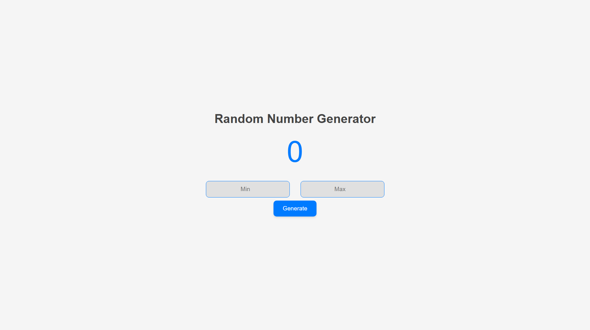

# Number Generator

## Description
This project is a simple number generator application. It allows you to generate random numbers within a specified range.

## Features
- Generate random numbers
- Specify the minimum and maximum range
- Display the generated number

## Screenshot


## Installation
To install and run this project, follow these steps:

1. Clone the repository:
   ```bash
   git clone https://github.com/EagleIsCoding/numberGenerator.git
